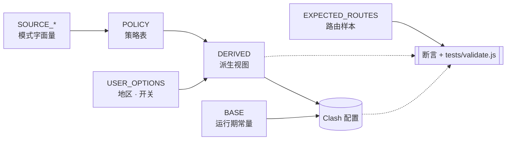

# clash-override-chain-proxy


> 你是不是也遇到过：打开 ChatGPT、Claude，Cloudflare 验证页死活过不去，刷新十次还在 "checking your browser"；或者某天登录直接看到账号被封，申诉回来一句"违反使用条款"，没人告诉你到底是哪条规则、哪个 IP、哪次请求踩了线。问题的根子往往不在你这边，而在你用的机场 IP——那串地址早被平台识别成共享代理，和你一起用它的陌生人早把风控额度刷光了。
>
> 还有一种更尴尬的：你常驻新加坡，Claude Code 用得顺手得很，临时被派去北京 / 上海出差几天，酒店 Wi-Fi 一连，Claude Code 直接 timeout，`npm install` 半天没动静，`raw.githubusercontent.com` 直接被污染——本来想趁着会议间隙改两行代码，结果整套开发环境先瘫了。
>
> 这份 Clash Party 覆写脚本做的事很直接：把 AI 整条链路——会话本体（ChatGPT / Claude / Gemini / Perplexity / Cursor 等）、登录反机器人、订阅支付、特性开关与错误上报——全部锁进你自己的家宽 IP 链式出口，平台每次看到的都是同一张干净的家用 IP 面孔。流媒体、社交、IM 走独立的 `mediaRegion` 地区组，不占家宽带宽；域内业务（办公、云、AI、消费类）直连不绕弯。DNS、Sniffer、分流规则三层共用一份分类，从根上消除"规则写对了但 DNS 解析走岔，出口还是偏"的常见踩坑。出差在外的那几天，Claude Code 仍然从 SG 的家宽稳稳出去——GitHub / npm / PyPI / Statsig 跟着一起入链，CLI 不掉线。

**当前版本：** v9.2

## Features

- **链式家宽出口** — 把所有 AI 相关流量收口到一张干净的家宽 IP：
  - **AI 服务**：Claude / ChatGPT / Gemini / Perplexity / Cursor / xAI / Meta AI / OpenRouter / Antigravity / Mistral / Hugging Face / Replicate / Groq / Together / ElevenLabs / Midjourney / Runway / Stability / Ideogram / Civitai / Character.ai / Pi / You.com 等
  - **支撑平台**：Google / Microsoft / GitHub / GitLab / Atlassian；包括 `githubusercontent.com`、npm / PyPI / crates.io / Docker Hub 等包仓库，以及 Vercel / Netlify / Supabase / Fly.io / Render / Railway 等部署平台 —— 出差到 GFW 范围内 Claude Code 与日常开发都不掉线
  - **AI 共享集成**：登录反机器人（Arkose / reCAPTCHA / hCaptcha）、第三方鉴权（Auth0 / Clerk / Okta）、订阅支付（Stripe / PayPal / Paddle / Lemon Squeezy）、特性开关与错误上报（Statsig / Sentry / PostHog / Segment / Mixpanel / Amplitude / Datadog）—— 让 AI 会话整条链路的 IP 指纹始终一致
  - **进程级**：受管 AI 桌面 App、AI 浏览器（Dia / Atlas / SunBrowser，可关）、AI CLI（`claude` / `gemini` / `codex`）
- **媒体独立选区** — 4 类共 20+ 站点全部走 `mediaRegion` 普通地区组，不占家宽链路：
  - **视频流媒体**：YouTube / Netflix / Disney+ / HBO Max / Hulu / Prime Video / Twitch / Peacock / Paramount+ / Crunchyroll / Vimeo / Dailymotion
  - **音乐**：Spotify / SoundCloud / Bandcamp
  - **社交**：X (Twitter) / Meta（FB / IG / Threads）/ Reddit / TikTok / Snapchat / Pinterest / Bluesky / Tumblr；长文 Medium / Substack / Patreon；社区 Goodreads / Letterboxd
  - **即时通讯**：Telegram / Discord / LINE / WhatsApp / Signal
- **DIRECT 与默认代理保留** — 不该走代理的别走代理：
  - **域外直连**（DIRECT + 域外 DoH）：Apple / iCloud、出口验证（`ip.sb` / `ifconfig.me` / `ipinfo.io` / `ping0.cc`）、沉浸式翻译 / MinerU、Tailscale / ZeroTier / Plex / Synology / Typeless
  - **域内直连**（DIRECT + 域内 DoH）：办公（腾讯 / 钉钉 / 飞书 / WPS）、云与 CDN（阿里 / 腾讯 / 华为 / 百度 / 字节 / 京东等）、域内 AI（DeepSeek / Doubao / MiniMax / Baichuan / Stepfun）、消费类（Bilibili / Weibo / 知乎 / 小红书 / 抖音 / 网易 / 爱奇艺 / 优酷 / 淘宝 / 京东 / 美团 / 米哈游 等）
  - **域外通用 CDN**（默认代理 + 域外 DoH）：Cloudflare / AWS / CloudFront / Fastly / Akamai / Azure CDN / jsDelivr / Bunny / Cloudinary
  - **私有网络**（IP-CIDR 直连）：RFC 1918、链路本地、CGNAT、IPv6 ULA，避免被误代理
- **DNS / Sniffer / Rules 同一套分类** — POLICY 一处定义，下游 DNS、Sniffer、分流规则自动同步，从根上解决"规则对但解析跑偏"。

## Requirements

- [Clash Party](https://github.com/clash-verge-rev/clash-verge-rev) 或其他兼容 JavaScriptCore 覆写的 Clash 客户端
- 一份代理订阅，至少包含 `US / JP / HK / SG / TW / KR` 任一个地区的节点
- 一份家宽 IP 服务（作链式代理的前置出口）
- Node.js（仅 `tests/validate.js` 用，不是运行时依赖）

示例资源（可选）：代理订阅 [办公娱乐好帮手](https://xn--9kq10e0y7h.site/index.html?register=twb6RIec) · 家宽 IP [MiyaIP](https://www.miyaip.com/?invitecode=7670643)

## Usage

### 1 · 下载脚本

把两份脚本抓到本地：

- [`src/MiyaIP 凭证.js`](src/MiyaIP%20%E5%87%AD%E8%AF%81.js) — 凭证模板（仅一次性填入）
- [`src/家宽IP-链式代理.js`](src/%E5%AE%B6%E5%AE%BDIP-%E9%93%BE%E5%BC%8F%E4%BB%A3%E7%90%86.js) — 主脚本

### 2 · 填家宽凭证

打开 `MiyaIP 凭证.js`，把家宽 IP 服务面板上给你的账号 / 端点信息填进去：

```javascript
function main(config) {
  config._miya = {
    username: "你的用户名",
    password: "你的密码",
    relay:   { server: "12.34.56.78",          port: 8022 }, // 家宽出口
    transit: { server: "transit.example.com",  port: 8001 }  // 官方中转
  };
  return config;
}
```

### 3 · 按顺序导入两份覆写

在 Clash Party 的覆写页**按下面的顺序**导入。顺序反了，主脚本会读不到 `config._miya` 直接抛错：

1. `MiyaIP 凭证.js`
2. `家宽IP-链式代理.js`


### 4 · 调整 `USER_OPTIONS`

主脚本顶部只有三个开关：

```javascript
var USER_OPTIONS = {
  chainRegion: "SG",           // AI 家宽出口前一跳地区
  mediaRegion: "US",           // 媒体地区
  routeBrowserToChain: true    // AI 浏览器（Dia / Atlas / SunBrowser）按进程名是否也走 chainRegion
};
```

| 场景 | 配置 |
|---|---|
| ChatGPT 看起来在美国 | `chainRegion: "US"` |
| Claude 看起来在日本 | `chainRegion: "JP"` |
| Netflix / Disney+ 美区 | `mediaRegion: "US"` |
| AI 走日本、媒体走美国 | `chainRegion: "JP"`, `mediaRegion: "US"` |
| 关闭 AI 浏览器进程绑定 | `routeBrowserToChain: false` |

**支持地区：** `US` · `JP` · `HK` · `SG` · `TW` · `KR`

**Fallback：** 首选地区订阅里没节点时按内置顺序自动找下一个：
- 链式出口：`SG → TW → JP → KR → US`
- 媒体组：`US → JP → HK`

### 5 · 启用并跑起来

启用两份覆写 → 切到你的机场订阅 → 启动代理（**规则模式** + **TUN 模式**）。脚本会在 `代理组和节点` 区原地注入三个受管代理组（示例为默认 SG / US 配置）：

| 组名 | 类型 | 作用 |
|---|---|---|
| `🇸🇬新加坡-AI|链式代理.跳板` | `url-test` | 当前 `chainRegion` 的订阅节点池，作家宽出口的前一跳 |
| `🇸🇬新加坡-AI|链式代理.家宽出口` | `select` | 链式出口组（家宽出口 ↔ 官方中转，二选一） |
| `🇺🇸美国-媒体` | `url-test` | `mediaRegion` 地区组，承载 `SOURCE_MEDIA` 全部域名 |

地区前缀不是硬编码的——改 `chainRegion` / `mediaRegion`，组名跟着改；首选地区在订阅里找不到节点，自动按 fallback 顺序顺延到第一个有节点的地区。


### FAQ

- **报错 `缺少 config._miya`** — 覆写顺序反了。把 `MiyaIP 凭证.js` 拖到主脚本前面，并确认凭证已经填好（不是 `你的用户名` 这种占位符）。
- **报错 `未找到可用的 chainRegion 节点 / mediaRegion 媒体节点`** — 脚本按 fallback 顺序试过所有候选仍然没命中。确认订阅至少包含一个可识别的 `US / JP / HK / SG / TW / KR` 节点，并检查节点命名能否被 `BASE.regions[XX].regex` 匹配（默认认国旗 emoji、中文地区名、或 `US-` / `JP-` 这类英文前缀）。
- **机场把 SG 节点叫 `Singapore`** — 直接改 `BASE.regions.SG.regex`，加一段 `|Singapore` 进去就行。
- **想加一个新地区（比如 `DE`）** — 在 `BASE.regions` 加一行（regex / label / flag），再按需要塞进 `BASE.regionFallbackOrder.chain` 或 `.media`，下游代理组、规则、DNS 全部会自动跟上。

### 升级 / 卸载

- **升级**：从仓库重新下载 `家宽IP-链式代理.js`，覆盖 Clash Party 里同名覆写即可。`MiyaIP 凭证.js` 不动（凭证留在本地）。重启代理生效；脚本是幂等的，重复跑不会产生重复组或自引用规则。
- **卸载**：在 Clash Party 关掉两份覆写，刷新一次订阅即可还原（脚本是覆写而非破坏，原始订阅完好）。

## Testing

```bash
node tests/validate.js
```

测试用 `vm` 隔离加载脚本，覆盖默认配置、地区 fallback、开关组合、缺失地区报错、幂等重跑、受管对象修复等 15 个用例。

## Architecture



脚本三层：**输入 (USER_OPTIONS / BASE / SOURCE_*) → 策略 (POLICY → DERIVED) → 配置/校验 (main → assert)**。每一步只读上一层的输出，所有路由 / DNS / sniffer 决策都汇总到 `POLICY` 一处。完整定义见 [`src/家宽IP-链式代理.js`](src/%E5%AE%B6%E5%AE%BDIP-%E9%93%BE%E5%BC%8F%E4%BB%A3%E7%90%86.js) 文件头部。

### 输入层

- **`USER_OPTIONS`** — 地区选择 + 浏览器开关。
- **`BASE`** — 运行期常量：地区表、节点名、组名后缀、DoH 服务器、规则前缀。
- **`SOURCE_*`** — `+.domain` 字面量，按路由意图分桶（不掺杂行为字段）。
- **`EXPECTED_ROUTES`** — 端到端样本，声明"这几个域名 / 进程必须落到这里"。是加载期校验、运行期校验、`tests/validate.js` 三方共用的唯一期望来源。

### SOURCE 对照表

| SOURCE | 代表内容 | DNS | 出口 |
|---|---|---|---|
| `SOURCE_CHAIN.ai` | 域外 AI 服务（Anthropic / OpenAI / Google AI / Perplexity / Cursor / xAI / Meta AI / OpenRouter / Antigravity / Mistral / HF / Replicate / Groq / Together / ElevenLabs / Midjourney / Runway / Stability / Ideogram / Civitai / Character.ai / Pi / You / Phind / Kagi 等） | 域外 DoH | `chainRegion` 家宽出口 |
| `SOURCE_CHAIN.support` | 开发支撑平台：Google / Microsoft / GitHub / GitLab / Atlassian / 包仓库（npm / PyPI / crates.io / Docker Hub / RubyGems）/ 部署平台（Vercel / Netlify / Supabase / Fly.io / Render / Railway）/ JetBrains / Stack Overflow / MDN / Read the Docs / GitBook | 域外 DoH | `chainRegion` 家宽出口 |
| `SOURCE_CHAIN.integrations` | AI 会话共享的第三方集成：反机器人（Arkose / FunCaptcha / reCAPTCHA / hCaptcha）、鉴权（Auth0 / Clerk / Okta）、支付（Stripe / PayPal / Paddle / Lemon Squeezy）、telemetry（Statsig / Sentry / PostHog / Segment / Mixpanel / Amplitude / Datadog） | 域外 DoH | `chainRegion` 家宽出口 |
| `SOURCE_CHAIN.force` | Cloudflare 基础设施（含 Turnstile） | 域外 DoH | `chainRegion` 家宽出口 |
| `SOURCE_CHAIN.apps` | 受管 AI 桌面 App、AI 浏览器（Dia / Atlas / SunBrowser）、AI CLI（`claude` / `gemini` / `codex`） | — | `chainRegion`（按进程名） |
| `SOURCE_MEDIA` | 视频流媒体（YouTube / Netflix / Disney+ / HBO Max / Hulu / Prime Video / Twitch / Peacock / Paramount+ / Crunchyroll / Vimeo / Dailymotion）、音乐（Spotify / SoundCloud / Bandcamp）、社交（X / Meta / Reddit / TikTok / Snapchat / Pinterest / Bluesky / Tumblr / Medium / Substack / Patreon / Goodreads / Letterboxd）、IM（Telegram / Discord / LINE / WhatsApp / Signal） | 域外 DoH | `mediaRegion` 媒体组 |
| `SOURCE_GLOBAL_DEFAULT` | 通用域外云 / CDN：Cloudflare DNS / AWS / CloudFront / Fastly / Akamai / Azure CDN / jsDelivr / Bunny / Cloudinary | 域外 DoH | 保留默认代理 |
| `SOURCE_CN_DIRECT` | 域内 AI（含 DeepSeek / Doubao / MiniMax / Baichuan / Stepfun）/ 办公协作 / 云 / CDN / 消费类（Baidu / Bilibili / Weibo / 知乎 / 小红书 / 抖音 / 快手 / 网易 / 爱奇艺 / 优酷 / 淘宝 / 京东 / 美团 / 米哈游 等） | 域内 DoH | `DIRECT` |
| `SOURCE_OVERSEAS_DIRECT` | Apple / iCloud / 出口验证（含 `ip.sb` / `ifconfig.me`）/ 沉浸式翻译 / MinerU / Tailscale / ZeroTier / Plex / Synology QuickConnect / Typeless | 域外 DoH | `DIRECT` |
| `SOURCE_LOCAL_DIRECT` | Apple 推送 / 局域网 / 本地域名（含 `home.arpa`） | 域内 DoH | `DIRECT` |
| `SOURCE_NETWORK_DIRECT` | 私有网络 IP-CIDR：RFC 1918（10/8、172.16/12、192.168/16）/ 链路本地（169.254/16、fe80::/10）/ CGNAT（100.64/10）/ Tailscale magic IP / IPv6 ULA（fc00::/7） | — | `DIRECT` |

每条 `SOURCE_*` 在 `POLICY` 里都有对应 entry，把"DNS 走哪"和"出口走哪"一并定下。改归类 = 改一处 = 下游 `nameserver-policy` / 分流规则 / Sniffer / `fallback-filter` 全部跟着变。

### 策略与派生

- **`POLICY`** — 单一权威表。每条 entry 写明 `route` / `dnsZone` / `sniffer` / `fakeIpBypass` / `fallbackFilter`。
- **`DERIVED`** — 从 POLICY 投影出的下游视图：`patterns` (`chain` / `media` / `direct` / `fakeIpBypass` / `sniffer.{force,skip}`)、`processNames` (`aiApps` / `aiCli` / `browser`)、`networkRules.direct`。`build*` / `write*` 直接从这里读。

### 配置与校验

- **`main(config)`** — 主流程，原地改写并返回 config。
- **`assertExpectedRoutesCoverage`** — 加载期断言：样本必须能在 `SOURCE_*` 中匹配。
- **`validateManagedRouting`** — 运行期断言：关键规则、组、`dialer-proxy` 都正确。
- **`tests/validate.js`** — 端到端测试，`vm` 隔离跑 15 个用例。

### 命名约定

按前缀一眼看出副作用：

- **`build*`** — 纯函数，只返回值。
- **`resolve*`** — 读 + 幂等写。
- **`write*`** — 改 config。
- **`assert*`** — 运行期断言，失败即抛错。

## DNS 与 Sniffer

分流规则只决定流量走哪个出口。**DNS 解析进错地区、TLS 握手前域名没被嗅出来**——规则再对，出口照样跑偏。脚本让 DNS、Sniffer、分流规则三层共用同一份 POLICY。

- **`nameserver-policy`（域名 → DoH 服务器）** — POLICY 里 `dnsZone: "overseas"` 的全部绑到 Google / Cloudflare DoH，`dnsZone: "domestic"` 的绑到 AliDNS / DNSPod。基础 `nameserver` / `fallback` 也拆域内 / 域外两组，`fallback-filter` 配 `geoip-code: CN` 让域内 IP 走域内 DoH、其余走 fallback。
- **`fake-ip-filter`（fake-ip 白名单）** — Apple 推送、iCloud、本地域名（`+.lan` / `+.local` / `+.localhost` / `+.home.arpa`）、NTP、连通性探测、游戏主机（Xbox / PSN / Switch）、STUN（WebRTC）、家用路由器。这些**对真实 IP 敏感**，fake-ip 会直接把它们打死。
- **`force-domain`（强制嗅探）** — 所有 chain 路由的域名 + Cloudflare 基础设施。纯 IP / QUIC 握手时没有 SNI 线索，强制嗅探让它们仍能命中链式代理规则，避免回落到 `MATCH`。
- **`skip-domain`（跳过嗅探）** — Apple 推送、本地域名、Tailscale / ZeroTier / Plex / Synology / Typeless、沉浸式翻译 / MinerU 这类"直连但走域外 DoH"的应用。**故意**保留原始 IP 语义，嗅探反而破坏（P2P 打洞、Apple 推送 SNI 假名、直连被改写出口）。

四类配置都从 POLICY 的 `dnsZone` / `sniffer` / `fakeIpBypass` / `fallbackFilter` 字段投影——改一处全同步。

## Compatibility

- **运行环境：** Clash Party 的 JavaScriptCore
- **语法范围：** ES5（无箭头函数、解构、模板字符串、展开语法）
- **进程分流：** 当前只维护 macOS 常见命名，其他平台需自行扩展

## License

MIT — 见 [LICENSE](LICENSE)。
