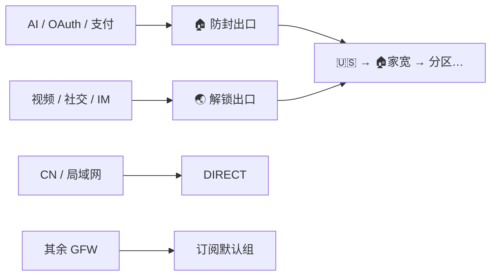

# clash-override-residential-exit

Clash 覆写脚本（ES5）。把 AI / OAuth / 支付绑到 **防封出口**，媒体与社交绑到 **解锁出口**，降低机房 IP 与出口不一致带来的封号风险。

**版本：** v14.41 · 脚本 [`src/residential-exit-override.js`](src/residential-exit-override.js)

## 快速开始

1. 填写脚本顶部的 `USER_OPTIONS` 与 `RESIDENTIAL_CREDENTIALS`（勿留占位符）
2. 在 Clash Verge / 兼容客户端覆写页导入并启用
3. 使用规则模式 + TUN；日常把防封出口选到 🏠 家宽节点组

```javascript
var USER_OPTIONS = {
  enabled: true, // false=旁路透传
  overrideMode: "merged", // merged | dns-sniffer-only
  rejectQuic: true, // false=允许 HTTP/3
  dnsListen: "127.0.0.1:1053", // 空串回退此默认；局域网可改 0.0.0.0:1053
};

var RESIDENTIAL_CREDENTIALS = {
  username: "",
  password: "",
  transit: { server: "", port: 8001 }, // 官方中转 SOCKS5；需共用认证
  homeStatic: { server: "", port: 8022 }, // 静态IP SOCKS5；认证可选
};
```

| 项 | 说明 |
|---|---|
| `merged` | DNS / Sniffer + 家宽节点 + 代理组 + 规则 |
| `dns-sniffer-only` | 只写 DNS / Sniffer，不读凭证 |
| `username` / `password` | 顶层共用；中转必填，静态IP 可空 |
| `transit` / `homeStatic` | 只填 `server`/`port`；任一配齐即注入；都空或占位则降级 |

本地凭证可参考 gitignore 的 `src/residential-credentials.js`，勿提交密钥。

## 代理组

| 组 | 成员 / 指向 | 作用 |
|---|---|---|
| `az.严管调度.🏠 防封出口` | 见下方优选序 | AI / 登录 / 支付总闸 |
| `az.严管调度.🤖 AI 服务` | → 防封出口 | 分类面板，勿单独改出口 |
| `az.严管调度.🔑 登录旁路` | → 防封出口 | OAuth / 验证 |
| `az.严管调度.💳 支付验证` | → 防封出口 | 支付 / feature flag |
| `az.其他调度.🌏 解锁出口` | 同防封候选 | 媒体 / 社交总闸 |
| `az.其他调度.🎬 / 🎵 / 🌐 / 💬` | → 解锁出口 | 与防封解耦 |
| `az.分区测速.🇺🇸🇸🇬🇯🇵🇰🇷🌸🇭🇰` | url-test | 订阅地区节点；台湾为 🌸 中华台北 |
| `az.其他测速.🏠 家宽节点组` | 官方中转 → 静态IP | 家宽实体；默认优选中转 |

节点名：`🏠 家宽出口（官方中转）` / `🏠 家宽出口（静态IP）`。

### 总闸优选序

```
🇺🇸 → 🏠 家宽节点组 → 🇸🇬 → 🇯🇵 → 🇰🇷 → 🌸 → 🇭🇰
```

无美区时，家宽排在最前。防封请手动选 🏠 家宽（或其内的中转 / 静态IP）。

## 流量怎么走

脚本丢弃订阅规则与多余代理组，保留节点与默认代理组：

```
QUIC 拦截（可选）
  → 严管域名 → 防封出口
  → 其他调度域名 → 解锁出口
  → DoH / 直连 / CN
  → AI 进程 → GEOSITE,gfw → MATCH（订阅默认组）
```

| 防封（严管） | 解锁 | 不显式维护（GFW / MATCH） |
|---|---|---|
| Claude / ChatGPT / Gemini+Antigravity / Meta AI / Perplexity / xAI | YouTube / Netflix / Disney+ / Max / Twitch / Prime | OpenRouter、Mistral、HF、Cursor、部署平台 |
| GitHub、npm、PyPI；OAuth / Arkose / Stripe / Auth0 | Spotify、X / Facebook / Reddit / TikTok | LinkedIn、Slack、Signal |
| AWS / Azure / Cloudflare 基建 | Telegram / Discord / LINE / WhatsApp | 整树 google.com / microsoft.com |

进程：Claude / ChatGPT / Codex / Perplexity；Gemini + Antigravity（App / IDE / CLI）；AI 浏览器仅 Comet / Dia / Atlas。不管控 Cursor。

仅 `DOMAIN-SUFFIX`；国内站与局域网 `DIRECT`。


```mermaid
flowchart LR
  A[AI / OAuth / 支付] --> B[🏠 防封出口]
  B --> C[🇺🇸 → 🏠家宽 → 分区…]
  D[视频 / 社交 / IM] --> E[🌏 解锁出口]
  E --> C
  F[CN / 局域网] --> G[DIRECT]
  H[其余 GFW] --> I[订阅默认组]
```

## 机制摘要

- **家宽**：SOCKS5 注入官方中转与/或静态IP；未配置则家宽组降级为分区 / DIRECT
- **默认组**：精确名 → MATCH 目标 → 关键词；露出防封 / 解锁总闸与分区、家宽组
- **DNS**：Fake-IP + `respect-rules`；高敏域绑域外 DoH；Sniffer `force-domain` 防漏路由
- **凭证兼容**：顶层 `username`/`password` 为空时，可回退端点内嵌字段

## 要求与测试

- Clash Verge 或兼容 JavaScriptCore 覆写的客户端
- 代理订阅（建议含 US / SG / JP 等至少一区）
- 防封号请配置 `transit` 或 `homeStatic`
- `node tests/test.js`（16 单元 + 30 集成）

变更见 [CHANGELOG.md](CHANGELOG.md)。

## License

MIT — [LICENSE](LICENSE)。
