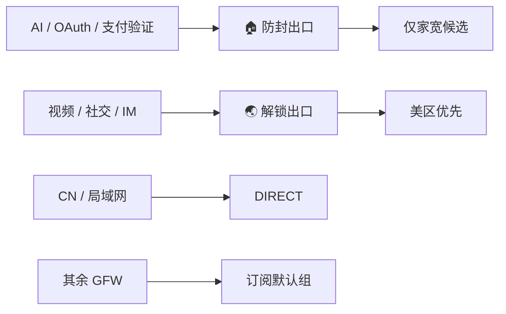

# clash-override-residential-exit

Clash 覆写脚本。核心目标：**降低域外 AI（Claude / ChatGPT / Gemini 等）因机房 IP、出口不一致被风控封号的风险**。

做法：AI / OAuth / 支付 / 反机器人流量绑到同一套 **防封出口**（有家宽时只出现家宽候选）；媒体与社交走独立的 **解锁出口**，改解锁不影响 AI。

**版本：** v14.33

## 快速开始

1. 打开 [`src/residential-exit-override.js`](src/residential-exit-override.js)
2. 填写 `USER_OPTIONS` 与 `RESIDENTIAL_CREDENTIALS`（勿留文档占位符，否则不会注入出口节点）
3. 在 Clash Verge / 兼容客户端的覆写页导入并启用；规则模式 + TUN

```javascript
var USER_OPTIONS = {
  enabled: true,                 // false = 旁路，config 原样透传
  overrideMode: "merged",        // "merged" | "dns-sniffer-only"
  rejectQuic: true,              // 拦截 UDP:443，迫使回退 TCP+TLS
  dnsListen: "127.0.0.1:1053",    // 局域网共享可改 0.0.0.0:1053
};

var RESIDENTIAL_CREDENTIALS = {
  username: "",
  password: "",
  transit: {                     // 官方中转（SOCKS5）；需填共用认证
    server: "",
    port: 8001,
  },
  homeStatic: {                  // 静态IP（SOCKS5）；认证可选
    server: "",
    port: 8022,
  },
};
```

| 配置 | 作用 |
|---|---|
| `overrideMode: "merged"` | DNS / Sniffer + 家宽节点 + 代理组 + 规则 |
| `overrideMode: "dns-sniffer-only"` | 只写 DNS / Sniffer，不读凭证 |
| `username` / `password` | 顶层共用；官方中转必填，静态IP 可空 |
| `transit` / `homeStatic` | 均为 SOCKS5，只填 `server`/`port`；任一配齐即算家宽；都空或占位则降级 |

## 防封号怎么生效

封号常见触发：**机房出口**、**主站与登录 / 验证 / 支付 IP 不一致**。

| 措施 | 行为 |
|---|---|
| 防封出口只挂家宽 | 配了 `transit` / `homeStatic` 时，候选只有家宽实体 + 家宽组，**不出现** US/JP 等机房组，避免 UI 误切 |
| 三分类锁总闸 | AI / 支撑 / 集成只指向防封出口，改一处即可，支付与验证不会单独跑飞 |
| OAuth 旁路 | consent / gstatic / googleusercontent 等进严管，减轻「主站家宽、静态机房」会话分裂 |
| 进程兜底 | Claude / ChatGPT / Codex 等在 CN 之后、GFW 之前跟防封出口 |
| 解锁出口独立 | 视频 / 社交 / IM 默认美区，改解锁不拆 AI 指纹 |

日常：确认 `🏠 防封出口` 停在家宽节点或家宽组。未配家宽时防封出口降级为家宽组内的地区/DIRECT（失去防封能力）。

## 调度小组

| 组 | 候选策略 | 说明 |
|---|---|---|
| `az.核心出口.🏠 家宽出口` | 静态 IP → 中转 | 家宽实体容器 |
| `az.严管调度.🏠 防封出口` | **仅家宽**（有凭证时） | 防封总闸；写入订阅默认组便于直达 |
| `az.严管调度.🤖 / 🛠️ / 🛡️` | → 防封出口 | 分类面板，勿单独改出口 |
| `az.其他调度.🌏 解锁出口` | 美区优先 → 家宽 | 媒体 / 社交总闸 |
| `az.其他调度.🎬 / 🎵 / 🌐 / 💬` | → 解锁出口 | 与防封解耦 |
| `az.分区测速.🇺🇸🇯🇵🇸🇬🇭🇰` | url-test | 订阅地区节点；供解锁出口与降级使用 |

```
防封出口（有家宽）: 静态IP → 官方中转 → 家宽组
解锁出口:           US → JP → SG → HK → 家宽实体 → 家宽组
```

## 流量怎么分

脚本丢弃订阅规则与多余代理组，保留节点与默认代理组：

```
QUIC 拦截（可选）
  → 严管域名（AI / 支撑 / 集成）→ 防封出口
  → 其他调度域名 → 解锁出口
  → DoH → 直连 / CN
  → AI 进程 → GEOSITE,gfw → MATCH（订阅默认组）
```

| 进防封（跟家宽） | 进解锁 | 不显式维护 |
|---|---|---|
| Claude / ChatGPT / **Gemini+Antigravity** / Meta AI / Perplexity / xAI | YouTube / Netflix / Disney+ / Max / Twitch / Prime | OpenRouter、Mistral、HF、Cursor、部署平台 → GFW/MATCH |
| GitHub、npm、PyPI；OAuth / Arkose / Stripe / Auth0 / Statsig | Spotify、X / Facebook / Reddit / TikTok | LinkedIn、Slack、Signal、SunBrowser |
| AWS / Azure / CF CDN 基建 | Telegram / Discord / LINE / WhatsApp | 整树 google.com / microsoft.com / Akamai / Fastly |

进程：Claude / ChatGPT / Codex / Perplexity；**Gemini + Antigravity（App / IDE / CLI）**；AI 浏览器仅 **Comet / Dia / Atlas**。不管控 Cursor。

仅维护 `DOMAIN-SUFFIX`。国内站与局域网走 `DIRECT`。

## 工作原理（简述）

- **节点** — 订阅节点保留；按需注入家宽 SOCKS5（官方中转 / 静态IP）。
- **默认代理组** — 精确名 → MATCH 目标 → 关键词；并注入防封 / 解锁总闸与家宽、分区组。
- **DNS** — Fake-IP + `respect-rules`；高敏域绑域外 DoH；`sniffer.force-domain` 防漏路由。


```mermaid
flowchart LR
  A[AI / OAuth / 支付验证] --> B[🏠 防封出口]
  B --> C[仅家宽候选]
  D[视频 / 社交 / IM] --> E[🌏 解锁出口]
  E --> F[美区优先]
  G[CN / 局域网] --> H[DIRECT]
  I[其余 GFW] --> J[订阅默认组]
```

## 要求与测试

- Clash Verge 或兼容 JavaScriptCore 覆写的客户端
- 代理订阅（建议含 US / JP / HK / SG 至少一区）
- 防封号请配置 `transit` 或 `homeStatic` 之一
- 测试：`node tests/test.js`（16 单元 + 30 集成）

变更记录见 [CHANGELOG.md](CHANGELOG.md)。

## License

MIT — 见 [LICENSE](LICENSE)。
