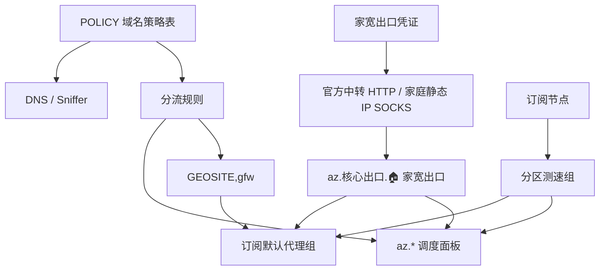

# clash-override-residential-exit

Clash 覆写脚本。通过 `家宽出口（官方中转）` 提供固定家宽出口，把 AI、开发平台、支付验证、遥测等高敏流量集中到可手动切换的调度面板里，降低出口 IP 不一致带来的风控风险。

**当前版本：** v14.19

## 快速开始

1. 下载 [`src/residential-exit-override.js`](src/residential-exit-override.js)
2. 填写 `RESIDENTIAL_CREDENTIALS` 和 `USER_OPTIONS`
3. 在 Clash 覆写页导入启用，规则模式 + TUN 启动

```javascript
var USER_OPTIONS = {
  enabled: true,                              // false = 完全旁路
  overrideMode: "merged",                    // "merged" | "dns-sniffer-only"
  rejectQuic: true,                           // false = 允许 HTTP/3（UDP:443）
  dnsListen: "127.0.0.1:1053"                  // DNS 监听；局域网共享可改 0.0.0.0:1053
};

var RESIDENTIAL_CREDENTIALS = {
  transit: {
    server: "transit.example.com",
    port: 8001,
    username: "你的用户名",
    password: "你的密码"
  },
  // 家庭静态 IP（SOCKS5，算家宽；可与官方中转并存，并存时优先）
  homeStatic: {
    server: "",
    port: 1080,
    username: "",
    password: ""
  }
};
```

| 选项 | 说明 |
|---|---|
| `enabled: false` | 旁路覆写，config 原样透传 |
| `overrideMode: "merged"` | DNS / Sniffer + 家宽出口 + 代理组 + 规则；出口全空/占位时降级（不注入节点，其余仍生效） |
| `overrideMode: "dns-sniffer-only"` | 只写 DNS / Sniffer，不读凭证 |
| `rejectQuic: false` | 关闭全局 UDP:443 REJECT，恢复 HTTP/3 |
| `dnsListen` | 覆盖 DNS listen；空串回退 `127.0.0.1:1053` |
| `RESIDENTIAL_CREDENTIALS.transit` | 官方中转 HTTP：`{ server, port, username, password }` |
| `RESIDENTIAL_CREDENTIALS.homeStatic` | 家庭静态 IP SOCKS5：同名字段；认证可空；与中转都算家宽 |

## 工作原理

脚本接收订阅 config，全部接管：

- **代理组** — 清除订阅附带的分组，只保留 `az.*` 管理组和默认代理组。家宽出口和分区测速组注入默认组候选列表。
- **规则** — 丢弃订阅全部规则，由 POLICY 投影生成。顺序：QUIC 拦截（可选，UDP:443 全局 REJECT）→ AI/支撑/集成域名（`DOMAIN-SUFFIX`）→ 媒体域名 → DoH → 直连 → CN → 进程 → GFW → MATCH。
- **DNS** — Fake-IP 模式、`respect-rules: true`，默认监听 `127.0.0.1:1053`。高敏域名通过 `nameserver-policy` 显式绑定域外 DoH，`sniffer.force-domain` 兜底恢复域名。
- **节点** — 全部保留不动。
- **默认代理组** — 先精确匹配 `PROXY`/`GLOBAL`，再从 MATCH 规则提取目标组，最后才按关键词（`PROXY`、`节点选择`、`手动选择`、`GLOBAL`）子串匹配。MATCH / DoH / GFW 统一指向它。

## 代理组

| 代理组 | 类型 | 流量 |
|---|---|---|
| `az.分区测速.🇺🇸 美国节点组` | url-test | 订阅中的美国节点 |
| `az.分区测速.🇯🇵 日本节点组` | url-test | 订阅中的日本节点 |
| `az.分区测速.🇸🇬 新加坡节点组` | url-test | 订阅中的新加坡节点 |
| `az.分区测速.🇭🇰 香港节点组` | url-test | 订阅中的香港节点 |
| `az.核心出口.🏠 家宽出口` | select | 家庭静态 IP（SOCKS，若配置）→ 官方中转（HTTP，若配置） |
| `az.严管调度.🎯 统一出口` | select | 严管实际出口选择（改这一处即可；**防封号请保持家宽**） |
| `az.严管调度.🤖 AI 高敏阵列` | select | AI 域名 / App / CLI / 浏览器 → 只挂统一出口 |
| `az.严管调度.🛠️ 支撑平台` | select | 开发平台 / CDN 基建 / OAuth 子域 / 出口检测 → 只挂统一出口 |
| `az.严管调度.🛡️ 生态域集成` | select | Arkose / Stripe / Auth0 / Statsig 等 AI 绑 IP 项 → 只挂统一出口 |
| `az.其他调度.🎬 视频流媒体` | select | YouTube / Netflix / Disney+ / Hulu / Twitch 等 |
| `az.其他调度.🎵 音乐播客` | select | Spotify / SoundCloud / Bandcamp |
| `az.其他调度.🌐 社交长文` | select | X / Facebook / Instagram / Reddit / LinkedIn 等 |
| `az.其他调度.💬 即时通讯` | select | Telegram / Discord / LINE / WhatsApp / Slack / Zoom 等 |

调度组候选顺序：

| 面板类型 | 默认首选 | 候选顺序 |
|---|---|---|
| `🎯 统一出口`（严管共用） | 家宽实体节点（若有） | 静态 IP / 中转 → 🏠 家宽组 → 🇺🇸 → 🇯🇵 → 🇸🇬 → 🇭🇰 |
| AI / 支撑 / 集成 | （固定）统一出口 | 仅 `🎯 统一出口`，不可各自另选 |
| 其他（视频 / 音乐 / 社交 / IM） | 🇺🇸 美国（若有） | 🇺🇸 → 🇯🇵 → 🇸🇬 → 🇭🇰 → 🎯 统一出口 → 家宽 |

不存在的地区不会出现。

## 路由映射

| 源桶 | 出口面板 |
|---|---|
| `RESIDENTIAL_EXIT.ai` | `az.严管调度.🤖 AI 高敏阵列` |
| `RESIDENTIAL_EXIT.support` + `CDN.cloud`（仅基础设施后缀） | `az.严管调度.🛠️ 支撑平台` |
| `RESIDENTIAL_EXIT.integrations`（精简：Arkose/Stripe/Auth0/Statsig 等） | `az.严管调度.🛡️ 生态域集成` |
| `MEDIA.video` | `az.其他调度.🎬 视频流媒体` |
| `MEDIA.music` | `az.其他调度.🎵 音乐播客` |
| `MEDIA.social` | `az.其他调度.🌐 社交长文` |
| `MEDIA.im` | `az.其他调度.💬 即时通讯` |
| `GFWLIST`（`GEOSITE,gfw`） | 订阅默认代理组 |
| `CN` / `LOCAL` / `NETWORK` / `OVERSEAS` | `DIRECT` |

## 行为边界

以下是有意的设计取舍，了解可避免意外：

- **空/占位凭证降级**：`merged` 下不抛错中断；DNS、规则、严管面板照常写入。官方中转与家庭静态 IP 都未配置时不注入出口节点，家宽组改挂地区测速（或 `DIRECT`）。
- **家庭静态 IP**：`homeStatic` 注入 SOCKS5 节点「家宽出口（家庭静态 IP）」，算家宽，进入 `🏠 家宽出口`；与官方中转并存时静态 IP 排在前面。
- **support / integrations 已收窄**：不再整树 `google.com` / `microsoft.com` / `cloudflare.com`；Google 留 OAuth（含 `consent` / `gstatic` / `apis` / `googleusercontent`）登录旁路；集成仅留 Arkose/Stripe/Auth0/Clerk/Statsig/Intercom/PostHog 等。出口检测站（ipinfo 等）走支撑面板以便验证家宽。
- **严管出口耦合**：AI / 支撑 / 集成三组只挂 `🎯 统一出口`。防封号请保持统一出口首选家宽；改成美区/机房测速组 = AI+支付+验证整包变 DC IP，前面域名工作归零。
- **进程规则在 CN 之后、GFW 之前**：明确域名与国内直连仍优先；AI / 浏览器进程访问的、被 `gfw` 收录但未显式维护的域名会进严管面板（默认家宽）。Chrome 等未列入的浏览器不受进程规则影响——网页「用 Google 登录」依赖上方 OAuth 旁路域，勿改统一出口。
- **默认代理组识别**：精确名 `PROXY`/`GLOBAL` → MATCH 目标（若组存在）→ 关键词子串。避免「PROXY备用」类组抢走订阅 MATCH 真主组。
- **CDN.cloud 不含消费站**：`amazon.com` / `pages.dev` / `workers.dev` 不进支撑面板，落到 GFW/MATCH；`amazonaws.com` / `cloudfront.net` / `cdn.cloudflare.net` 等基础设施仍走支撑。
- **不再生成 `DOMAIN-KEYWORD`**：一级标签子串曾导致误路由（如 `you` 吸走 YouTube）；现仅维护显式 `DOMAIN-SUFFIX`，边缘子域靠 sniffer `force-domain` 兜底。

## DNS 与 Sniffer

| 配置 | 来源 | 作用 |
|---|---|---|
| `nameserver-policy` | POLICY dnsZone | 逐条绑定域外/域内 DoH |
| `fake-ip-filter` | POLICY + 系统常量 | NTP、STUN、推送、局域网返回真实 IP |
| `force-domain` | 家宽出口全量域名 | SNI/Host 恢复域名，防漏到 MATCH |
| `skip-domain` | P2P/推送/局域网 | 保留 IP 语义，不嗅探 |
| `fallback-filter` | geoip + geosite:gfw | 非 CN 结果自动走域外 DoH |

## 数据流


```mermaid
flowchart TD
  A["POLICY 域名策略表"] --> B["DNS / Sniffer"]
  A --> C["分流规则"]
  D["家宽出口凭证"] --> E["官方中转 HTTP / 家庭静态 IP SOCKS"]
  E --> F["az.核心出口.🏠 家宽出口"]
  G["订阅节点"] --> H["分区测速组"]
  H --> I["订阅默认代理组"]
  F --> I
  F --> J["az.* 调度面板"]
  H --> J
  C --> J
  C --> K["GEOSITE,gfw"]
  K --> I
```

## 要求

- Clash Verge 或兼容 JavaScriptCore 覆写的客户端
- 代理订阅（`US / JP / HK / SG` 中至少一个地区节点）
- `merged` 模式需家宽出口中转端点
- Node.js 仅用于运行测试：`node tests/test.js`（16 单元 + 30 集成）

## License

MIT — 见 [LICENSE](LICENSE)。
